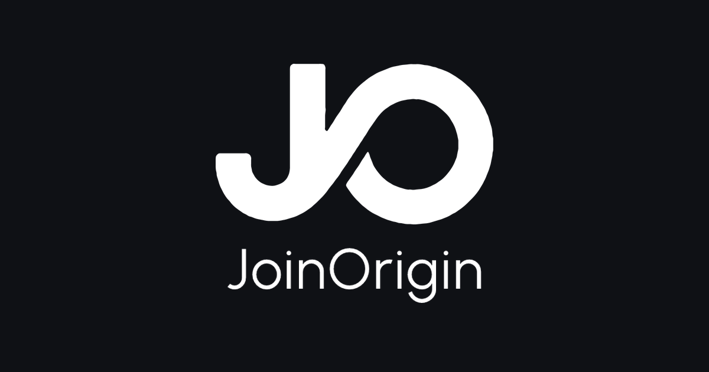

<div align="center">


# JoinOrigin

### A social collaboration network — the community OS that brings your people, communities, projects, and conversations into one calm workspace.

[](LICENSE)
[](app/.github/workflows/ci.yml)
[](app/tests/e2e/package.json)
[](app/package.json)
[](#-contributing)

**Join the waitlist → build with us → bring your community home.**

</div>

---

## 📖 Table of Contents

- [✨ What is JoinOrigin?](#-what-is-joinorigin)
- [🧭 Why JoinOrigin?](#-why-joinorigin)
- [🚀 Feature Highlights](#-feature-highlights)
- [🛠️ Tech Stack](#-tech-stack)
- [⚡ Getting Started](#-getting-started)
- [🏗️ Architecture Overview](#-architecture-overview)
- [📂 Repository Structure](#-repository-structure)
- [🤝 Contributing](#-contributing)
- [💬 Community](#-community)
- [📄 License](#-license)

---

## ✨ What is JoinOrigin?

JoinOrigin is a **social collaboration network** — a community OS that brings your
people, communities, projects, and conversations into one calm workspace. Instead
of juggling five separate tools, your relationships live in one place, so nothing
gets lost between them.

JoinOrigin is built around one belief: the most valuable asset is not content,
software, or AI — it is the **network of people and the relationships they form**.
Most platforms solve only one slice of the puzzle:

| Platform | Solves |
|---|---|
| LinkedIn | finding professionals |
| Discord | communicating |
| Reddit | discussing interests |
| GitHub | collaborating on code |
| TradingView | sharing trading ideas |

JoinOrigin combines these ideas into a single platform focused on turning
relationships into **real-world outcomes** — communities, projects, companies,
and opportunities.

> 💡 **The JoinOrigin promise:** you don't have to fit your community into a
> chat app or a feed. Build your profile, join communities around your
> interests, start projects, and invite the people you want to work with — all
> connected through one social graph.

**Onboarding-first by design.** JoinOrigin introduces itself the way social
platforms should: join the waitlist, reserve your spot, and walk in when your
community is ready. Early access opens in waves as the platform builds toward
launch, and your community is ready when you are.



---

## 🧭 Why JoinOrigin?

### The problem

Most platforms only serve one mode of connection — chat, feed, jobs, or code.
When your relationships span all of them, you end up with fragmented communities,
scattered conversations, and opportunities that slip through the cracks.

### The JoinOrigin approach

| Principle | What it means |
|---|---|
| 👥 **People first** | People join because of shared interests, goals, skills, and opportunities. |
| 🌱 **Communities drive growth** | Communities become the center of engagement — members communicate, learn, collaborate, and build relationships. |
| 🤝 **Collaboration creates value** | Projects, companies, investment opportunities, events, and ventures emerge naturally from communities. |
| 🔓 **Ownership and sovereignty** | Your identity, relationships, communities, and data are yours. The architecture is open and avoids unnecessary lock-in. |
| 🌐 **Open by default** | Communication runs on the open Matrix protocol, and the platform is designed to be self-hostable. |

JoinOrigin is organized around the **social graph** — the web of relationships
between members. Every profile, community, and project connects through people,
so your network becomes your operating system for collaboration.

---

## 🚀 Feature Highlights

- **👤 User Profiles** — a person's identity, experience, interests, skills, reputation, and contributions.
- **🏘️ Communities** — groups organized around interests, industries, goals, locations, or missions. AI Builders, Startup Founders, Quant Trading, Real Estate, Local Communities — or start your own.
- **💬 Communication** — real-time chat, direct messaging, group discussions, and community conversations, built on the open Matrix protocol.
- **📰 Feed** — a feed that surfaces the people and projects that matter to you, driven by your relationships.
- **📦 Projects** — start a project, invite collaborators, and turn conversations into shared work (Phase 2 — Collaboration).
- **🏢 Companies** — organize teams and ventures that grow out of your communities (Phase 3 — Organization).
- **🔑 Data sovereignty** — your identity and data are portable, and the platform is designed to be self-hostable.
- **📲 Cross-platform** — a Next.js web app and a React Native Android app share the same design system and UI components.

> 📍 **Where we are:** the web homescreen, waitlist onboarding, and community
> pages are live. Projects and companies arrive in later phases of the
> [roadmap](app/ROADMAP.md). Early-access members get the full roadmap as it ships.

---

## 🛠️ Tech Stack

| Layer | Technology |
|---|---|
| **Web** | [Next.js 14](https://nextjs.org/) (App Router) · [React 18](https://react.dev/) · [React Native Web](https://necolas.github.io/react-native-web/) · [styled-components](https://styled-components.com/) |
| **Mobile** | [React Native](https://reactnative.dev/) 0.74 (Android) |
| **Language** | [TypeScript](https://www.typescriptlang.org/) 5.5 |
| **Monorepo** | [pnpm](https://pnpm.io/) workspaces · [Turborepo](https://turborepo.com/) |
| **Design system** | `@joinorigin/design` tokens · `@joinorigin/ui` universal components |
| **Testing** | [Jest](https://jestjs.io/) + [React Testing Library](https://testing-library.com/) · [Playwright](https://playwright.dev/) end-to-end |
| **SEO / LLM** | `sitemap.ts` · `robots.ts` · `llms.txt` · JSON-LD (Organization, WebSite, FAQPage, AboutPage, ContactPage) |
| **Analytics** | Config-driven multi-tracker — Plausible / Umami / GA4 adapters |
| **Communication** | Open [Matrix](https://matrix.org/) protocol |

---

## ⚡ Getting Started

### Prerequisites

- [Node.js](https://nodejs.org/) 20+
- [pnpm](https://pnpm.io/) 10+
- [Docker](https://www.docker.com/) (for containerized services)

### Clone and run the web app

```bash
# 1. Clone the repository
git clone https://github.com/ambushalgorithm/joinorigin.git
cd joinorigin

# 2. Install dependencies (from the monorepo root)
cd app
pnpm install

# 3. Start the development server
pnpm dev
```

Open [http://localhost:3000](http://localhost:3000) — you'll land on the
JoinOrigin homescreen. Click **Get Started** to try the waitlist flow, or
browse the menu pages (`/features`, `/community`, `/docs`, `/about`,
`/contact`).

### Verify your setup

```bash
pnpm lint       # ESLint across all packages
pnpm typecheck  # TypeScript type checking
pnpm test       # Unit tests (Jest)
pnpm test:e2e   # End-to-end tests (Playwright)
```

> ⚙️ **Tooling notes:** the monorepo uses pnpm workspaces (`apps/*`,
> `packages/*`, `tests/e2e`) orchestrated by Turborepo. Every app and package
> owns its lint, typecheck, and test scripts — Turbo runs them across the whole
> workspace in dependency order.

---

## 🏗️ Architecture Overview

JoinOrigin is a contract-driven monorepo organized into **six layers** with a
strict, one-way dependency flow. Upper layers depend only on interfaces defined
by lower layers — no circular dependencies, no leaking implementation details
upward.

```
┌──────────────────────────────────────────────────────────────────┐
│  APPLICATION LAYER          Apps & workflows (web, mobile)        │
│  (Layer 6)                  depends on: platform contracts only   │
├──────────────────────────────────────────────────────────────────┤
│  WORKER PLATFORM LAYER      Runtime, workspace, memory, planning, │
│  (Layer 5 — core)           evaluation, governance, contracts     │
├──────────────────────────────────────────────────────────────────┤
│  PLATFORM SERVICES LAYER    PostgreSQL, Redis, MinIO, Qdrant,     │
│  (Layer 4)                  BullMQ, search, email                 │
├──────────────────────────────────────────────────────────────────┤
│  AUTOMATION & DELIVERY      CI/CD, test harnesses, artifacts      │
│  (Layer 3 — orthogonal)     active during build/deploy cycles     │
├──────────────────────────────────────────────────────────────────┤
│  INFRASTRUCTURE LAYER       Container runtime, networking,        │
│  (Layer 2)                  compute, volumes, observability       │
├──────────────────────────────────────────────────────────────────┤
│  DEPLOYMENT LAYER           Environment configs, service          │
│  (Layer 1)                  discovery, scaling, secrets           │
└──────────────────────────────────────────────────────────────────┘
```

| Layer | Position | Responsibility |
|---|---|---|
| **Application** | Top (Layer 6) | Worker assemblies, agent workflows, custom tool plugins |
| **Worker Platform** | Core (Layer 5) | Runtime, workspace, memory, planning, evaluation, governance, contracts |
| **Platform Services** | Provider (Layer 4) | Concrete service implementations (database, cache, queue, storage) |
| **Automation & Delivery** | Build/CI (Layer 3) | CI pipelines, test harnesses, artifact management, release orchestration |
| **Infrastructure** | Host (Layer 2) | Container runtime, networking, compute, volumes, observability |
| **Deployment** | Operations (Layer 1) | Environment definitions, service discovery, scaling, secrets management |

**Key architectural properties:**

- **Contract-driven** — all cross-layer communication passes through defined interfaces, never direct imports.
- **Provider-independent** — Platform Services are swappable via a Provider Registry resolved at startup.
- **Governance at every layer** — authorization, audit, and resource limits enforced independently.
- **Context as a first-class asset** — memory domains persist independently of any worker or vendor.
- **Portable & self-documenting** — every directory has a README; every concept has one canonical definition.

> 📚 **Read more:** the canonical architecture reference lives at
> [app/docs/ARCHITECTURE.md](app/docs/ARCHITECTURE.md). Start there, then
> explore the [vision](app/docs/VISION.md), [whitepaper](app/docs/ORIGIN-WHITEPAPER.md),
> and [development guide](app/docs/DEVELOPMENT.md).

---

## 📂 Repository Structure

```text
joinorigin/
├── app/                        # Monorepo (joinorigin monorepo root)
│   ├── apps/
│   │   ├── web/                # Next.js 14 web app (homescreen, menu pages, SEO)
│   │   └── mobile/             # React Native Android app
│   ├── packages/
│   │   ├── design/             # Design tokens: colors, spacing, typography, theme
│   │   └── ui/                 # Base universal UI components (styled-components/native)
│   ├── docs/                   # Architecture, vision, whitepaper, security, governance
│   ├── tests/
│   │   └── e2e/                # Playwright end-to-end tests
│   ├── infra/                  # Dockerfiles, compose files, infrastructure config
│   ├── scripts/                # Build, deploy, and utility scripts
│   ├── .github/                # CI/CD workflows
│   ├── package.json            # Workspace scripts (dev, build, lint, typecheck, test)
│   └── README.md               # Internal monorepo developer documentation
└── LICENSE                     # AGPL-3.0 (JoinOrigin Contributors)
```

| Path | Purpose |
|---|---|
| [`app/`](app/README.md) | The JoinOrigin monorepo — apps, packages, docs, tests, infra |
| [`app/apps/web/`](app/apps/web/README.md) | Web application (Next.js, landing pages, SEO, waitlist API) |
| [`app/apps/mobile/`](app/apps/mobile/) | Mobile application (React Native, Android) |
| [`app/packages/`](app/packages/README.md) | Shared libraries: design tokens and universal UI components |
| [`app/docs/`](app/docs/README.md) | Architecture, vision, whitepaper, security, governance, deployment |
| [`app/tests/`](app/tests/README.md) | Cross-cutting integration and end-to-end test suites |
| [`app/infra/`](app/infra/README.md) | Container and infrastructure definitions |
| [`app/scripts/`](app/scripts/README.md) | Build, deploy, and utility scripts |

---

## 🤝 Contributing

JoinOrigin is an open-source project, and contributors are welcome. Whether
you're fixing a bug, polishing the landing page, writing docs, or proposing a
new community feature — your help moves the network forward.

### Getting started

1. **Fork** the repository and clone your fork.
2. **Create a feature branch:** `git checkout -b feat/your-feature`
3. **Install dependencies:** `cd app && pnpm install`
4. **Run the checks before you commit:**
   ```bash
   pnpm lint
   pnpm typecheck
   pnpm test
   ```
5. **Open a pull request** against `main`. CI runs lint, typecheck, tests, and
   build on every PR — nothing merges until the whole pipeline is green.

### Guidelines

- **Branch naming:** `feat/<description>`, `fix/<description>`, `docs/<description>`.
- **Commit style:** conventional commits (`feat(web): ...`, `fix(mobile): ...`, `docs: ...`).
- **Tests:** add or update unit tests with every change; run `pnpm test:e2e` for UI changes.
- **Docs:** every new directory gets a `README.md`; keep the navigation map in sync.
- **Containerized by default:** every new service ships a `Dockerfile` and is wired into `docker-compose.yml` — nothing runs directly on the host.

### Where to start

- 👀 Browse open [issues](https://github.com/ambushalgorithm/joinorigin/issues).
- 🏷️ Look for `good first issue` labels.
- 💡 Join the conversation in the [community docs](app/apps/web/app/community/community-data.ts) and read the [whitepaper](app/docs/ORIGIN-WHITEPAPER.md) to understand the vision.

---

## 💬 Community

- **🐙 GitHub** — [ambushalgorithm/joinorigin](https://github.com/ambushalgorithm/joinorigin)
- **🐛 Issues** — [report a bug or request a feature](https://github.com/ambushalgorithm/joinorigin/issues)
- **📖 Whitepaper** — [JoinOrigin: One Page Vision](app/docs/ORIGIN-WHITEPAPER.md)
- **🌱 Roadmap** — [app/ROADMAP.md](app/ROADMAP.md)
- **📝 Changelog** — [app/CHANGELOG.md](app/CHANGELOG.md)

> 💌 **New here?** The best way to help the network grow is to join the waitlist
> on the homescreen, start a community around your interests, and invite the
> people you want to build with. Your community is ready when early access
> reaches your spot.

---

## 📄 License

JoinOrigin is licensed under the **GNU Affero General Public License v3.0** —
see [LICENSE](LICENSE) for the full text.

> **Why AGPL-3.0?** The AGPL keeps JoinOrigin open for everyone: you can read,
> modify, and run the software, and if you offer it as a networked service,
> you share your improvements back with the community. It's the license that
> keeps the social graph open.

Copyright © 2026 JoinOrigin Contributors.
